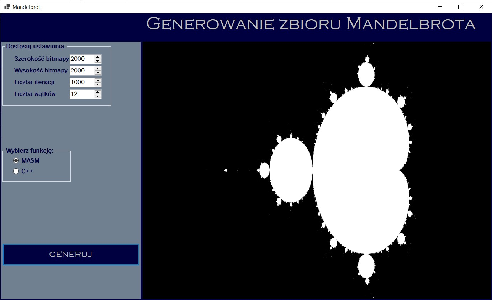
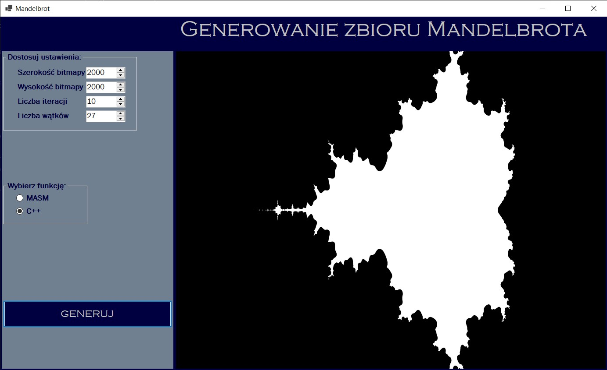
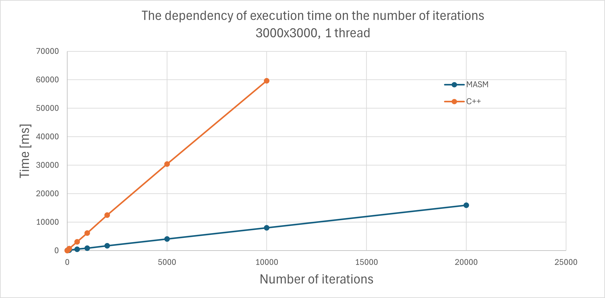
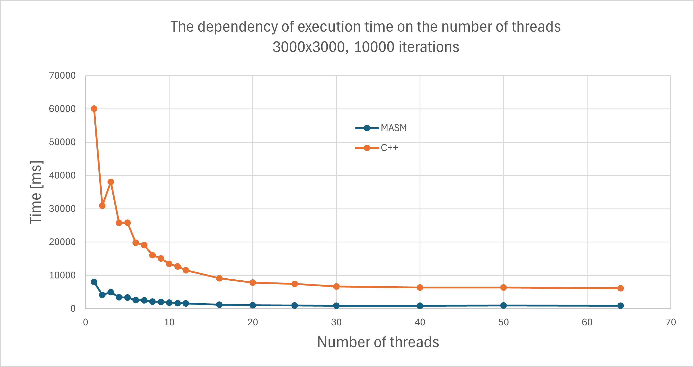

## General info
Program generates a Mandelbrot set in a form of a 24 bpp bitmap. Bitmap can be generated using algorithm written in either Assemlby with SSE instructions or C++. The program also supports multithreading.

## User interface
UI lets users choose number bitmap resolution, number of iterations and number of threads.  

  

## Time comparison
  

  

Time peaks for even numbers of threads are caused by use of early bailout in algorithm's loop.
